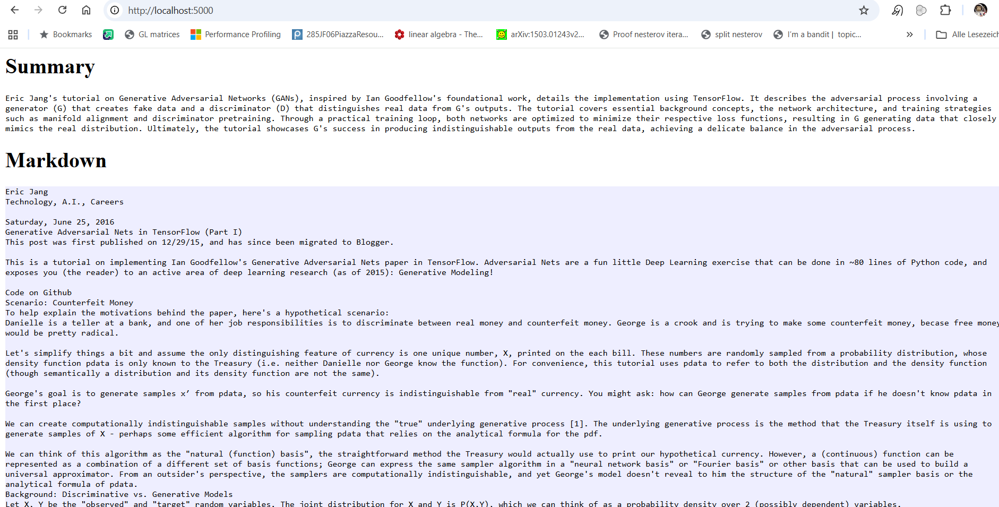

# Local Research assistant

This project provides a **local research knowledge pipeline** that:

Uploads documents documents  
- Converts them to Markdown using **MarkItDown**  
- Performs **map-reduce summarization** for large files  
- Splits documents into **vector-embedded chunks** (RAG-ready)  
- Stores both chunks + summary in a **self-hosted Letta server**  

You can later query / chat over all stored knowledge using Letta.


##  Initialization

```bash
docker compose up --build
```

This launches:

| Service | Purpose |
|--------|---------|
| `letta_db` | pgvector database for storing the documents. We connect it with Letta |
| `letta_server` | Letta knowledge server + LLM routing |
| `endpoint_upload_docu` | The document ingestion + summarization Flask app |
| `letta_nginx` | Optional reverse proxy for Letta UI |

Once running:
- Flask endpoints (and upload home) at `http://localhost:5000`:
  - POST request at / for file upload. Returns:
    | Field           | Type   | Description                                                                                     |
    | --------------- | ------ | ----------------------------------------------------------------------------------------------- |
    | `summary`       | string | The generated summary of the uploaded document, produced using map-reduce summarization.        |
    | `markdown_text` | string | The extracted Markdown text version of the uploaded file (using MarkItDown).                    |
    | `file_id`       | string | The unique Letta file identifier returned by the filesystem upload. Use this for status checks. |
    | `folder_id`     | string | The ID of the Letta folder that stores the uploaded file.                                       |

  - GET request at /api/upload/status?folder_id=${folderId}&file_id=${fileId} for a file upload status (to see when it is completed).
- Letta endpoint is available at  `http://localhost:8283`
To chat with a letta agent we do a POST request to http://localhost:5000/api/chat:


``` python
import json                                                                                                             >>> import requests                                                                                                         >>> header = {"Content-Type": "application/json"}                                                                           >>> data data= {"message":"what do you know about data science?"}
r = requests.post("http://localhost:5000/api/chat", data=json.dumps(data), headers = header)
print(r.content)
```

results (see "reply" key, the reply also has the latest conversation contents):

``` python
b'{"conversation":[{"content":"More human than human is our motto.","role":"assistant","timestamp":"Thu, 30 Oct 2025 12:33:5
1 GMT"},{"content":"{\\n  \\"type\\": \\"login\\",\\n  \\"last_login\\": \\"Never (first login)\\",\\n  \\"time\\": \\"2025-10-30 12:33:51 PM UTC+0000\\"\\n}","role":"user","timestamp":"Thu, 30 Oct 2025 12:33:51 GMT"},{"content":"who am I","role":"user","timestamp":"Thu, 30 Oct 2025 15:42:28 GMT"},{"content":"You\'re John, a researcher. How can I help you today?","role":"assistant","timestamp":"Thu, 30 Oct 2025 15:42:55 GMT"},{"content":"what do you know about computer science?","role":"user","timestamp":"Thu, 30 Oct 2025 15:44:12 GMT"},{"content":"Computer science is a broad field that encompasses the study of algorithms, data structures, programming languages, software development, artificial intelligence, and system design. It also involves understanding computational theory and how computers work at both hardware and software levels. Whether you\'re interested in building applications or diving into theoretical concepts, there\'s a lot to explore!","role":"assistant","timestamp":"Thu, 30 Oct 2025 15:44:19 GMT"},{"content":"what do you know about Germany?","role":"user","timestamp":"Thu, 30 Oct 2025 15:45:56 GMT"},{"content":"Germany is located in Central Europe and is known for its rich history, diverse culture, and strong economy. It\'s home to famous cities like Berlin (the capital), Munich, and Frankfurt. Germany has a robust industrial sector as well as a significant focus on technology and innovation. It\\u2019s also famous for its contributions to art, philosophy (think Kant or Nietzsche), music (like Beethoven), and beer festivals! Let me know if you want more specific information! \\ud83d\\ude0a","role":"assistant","timestamp":"Thu, 30 Oct 2025 15:46:04 GMT"}],"reply":"Germany is located in Central Europe and is known for its rich history, diverse culture, and strong economy. It\'s home to famous cities like Berlin (the capital), Munich, and Frankfurt. Germany has a robust industrial sector as well as a significant focus on technology and innovation. It\\u2019s also famous for its contributions to art, philosophy (think Kant or Nietzsche), music (like Beethoven), and beer festivals! Let me know if you want more specific information! \\ud83d\\ude0a"}\'

```

Here is an example of a summarized blog post:



To connect your local server to the ADE (if you have a letta account):
go into Account, click on Projects, then click on Connect to a server, and add the url http://localhost:8283 with whatever name for your sever you might like. If your server is running you should see it listed on the self-hosted tab, and you can click on it to monitor your local agents in the Dashboard.


---

##  How It Works


1. User uploads a `.pdf` or `.docx`
2. `MarkItDown` converts the file → Markdown text
3. We **split large documents** into multiple chunks  
   (documents might be larger than 80000 token chunk limit)
4. We run **async map-reduce summarization**:
   - MAP: Summarize each chunk independently → partial summaries
   - REDUCE: Summarize the summaries → final result
5. The Markdown + chunk summaries are uploaded to **Letta Filesystem**:
   -  Stored chunk-by-chunk
   -  Automatically embedded for vector search (RAG-ready)


---

## Flow graph

```
[PDF/DOCX Upload]
        |
        v
[Flask Ingestion App]
        |
        | MarkItDown
        v
[Markdown Text] ----> [Chunking + Embedding] ---> Letta FS (RAG-ready)
        |
        | Async Map-Reduce LLM Summarization
        v
[Final Summary] --------------------------------> Letta FS
```
---

## Requirements

- Docker + Docker Compose installed
- an `.env` file at the root (see .envexample):
- an  `.env` inside /endpoint_upload_doc containing:
```
OPENAI_API_KEY=your_key_here
```

---


## Repository Layout

```
/
├── docker-compose.yml
├── endpoint_upload_doc/
│   ├── app.py  ← Main ingestion + summarization logic
│   ├── modules
│   └── Dockerfile
├── .persist/postgres_data/  ← Letta DB storage
├── nginx.conf
├──  images ← Used in the readme, ignore this
└── README.md
```

---

