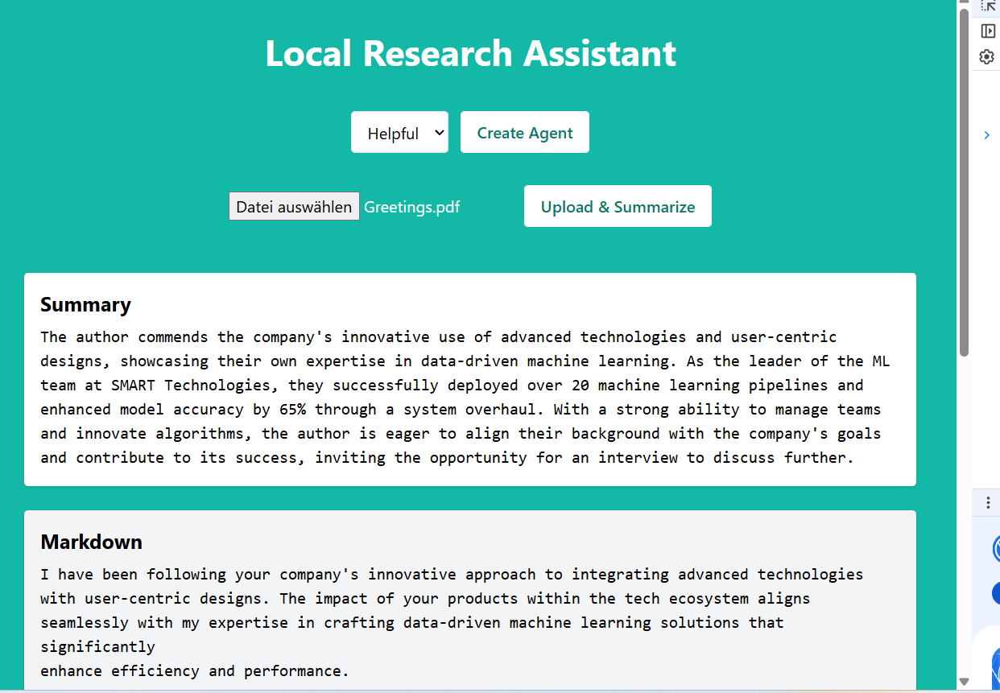
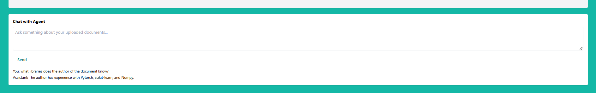
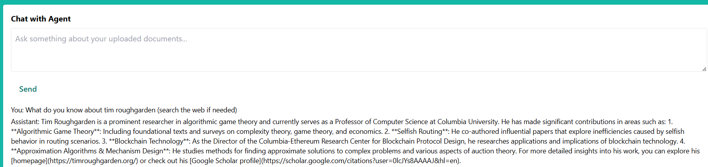
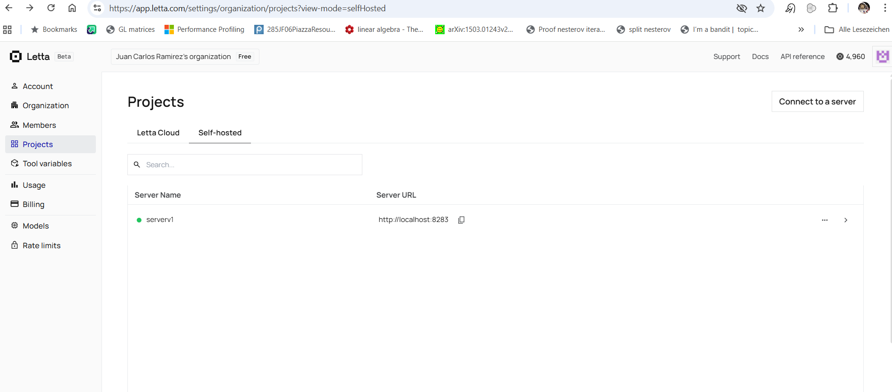

# Local Research assistant

This project provides a **local research knowledge pipeline** that:

Uploads documents documents  
- Converts them to Markdown using **MarkItDown**  
- Performs **map-reduce summarization** for large files  
- Splits documents into **vector-embedded chunks** (RAG-ready)  
- Stores both chunks + summary in a **self-hosted Letta server**  

You can later query / chat over all stored knowledge using Letta.

## Requirements
Youll need an OPENAI key, and for the web search engine, an EXA key: https://dashboard.exa.ai/
Make sure your docker containers have enough memory available (otherwise flask back-end app might die during upload).
- Docker + Docker Compose installed
- an `.env` file at the root (see .envexample).
- an  `.env` inside /endpoint_upload_doc.  both should contain:
```
OPENAI_API_KEY=your_key_here
EXA_API_KEY=your_EXA_KEY_HERE
```

---

##  Initialization

```bash
docker compose up --build
```

This launches:

| Service               | Purpose                                     |
| --------------------- | ------------------------------------------- |
| `letta_db`            | pgvector database                           |
| `letta_server`        | Letta LLM knowledge server                  |
| `endpoint_upload_doc` | Flask doc ingestion + summarization service |
| `letta_nginx`         | Nginx reverse proxy for letta_server        |
| `frontend`            | Next.js UI (port 3000)                      |


Once running:
-front-end (WOrk in progress) at `http://localhost:3000/`: 
  
  


- Flask endpoints (and upload home) at `http://localhost:5000/`:
   | Action                  | Method | Endpoint             |
   | ----------------------- | ------ | -------------------- |
   | Create agent            | `POST` | `/api/agent/create`  |
   | List agents             | `GET`  | `/api/agent/list`    |
   | Upload file             | `POST` | `/api/upload`        |
   | Check file embed status | `GET`  | `/api/upload/status` |
   | Chat with agent         | `POST` | `/api/chat`          |

- Letta endpoint is available at  `http://localhost:8283`

### Agent creation:
POST http://localhost:5000/api/agent/create
{
  "agent_name": "research_bot",
  "personality": "helpful"
}

| Field         | Required | Type   | Description                                             |
| ------------- | -------- | ------ | ------------------------------------------------------- |
| `agent_name`  | No, but recommended        | string | Agent name. If omitted, one is auto-generated. |
| `personality` | No        | string | Agent persona ("helpful" default).                      |

Response (Json) fields
| Field        | Description                            |
| ------------ | -------------------------------------- |
| `agent_id`   | Unique ID used for chat & file uploads |
| `folder_id`  | Folder where documents will be stored  |
| `agent_name` | Final name (auto-generated if omitted) |


### Upload Document

POST http://localhost:5000/api/upload

Form-data fields:

| Field      | Type   | Required |
| ---------- | ------ | -------- |
| `file`     | File   | yes      |
| `agent_id` | String | yes      |


Response:

| Field              | Description                  |
| ------------------ | ---------------------------- |
| `summary`          | LLM summary                  |
| `markdown_text`    | Extracted Markdown           |
| `file_id_summary`  | ID of summary file in Letta  |
| `file_id_markdown` | ID of markdown file in Letta |
| `folder_id`        | Letta folder ID              |
| `agent_id`         | Agent used                   |


After uploading a document we can send a GET request to http://localhost:5000/api/upload/status with params e.g:

```
http://localhost:5000/api/upload/status?folder_id=source-1add8bb9-913e-4a16-bd25-dcb0ed707a99&file_id=file-e8a4c2ee-c104-439d-be89-826659f5580c
```

shows upload of the file (completed when done):

``` json
{"file_id":"file-e8a4c2ee-c104-439d-be89-826659f5580c","status":"completed"}
To chat with a letta agent we do a POST request to http://localhost:5000/api/chat:
```

``` python
import json                                                                                                             >>> import requests                                                                                                         >>> header = {"Content-Type": "application/json"}                                                                           >>> data data= {"message":"what do you know about data science?"}
r = requests.post("http://localhost:5000/api/chat", data=json.dumps(data), headers = header)
print(r.content)
```

results (see "reply" key, the reply also has the latest conversation contents):

``` python
b'{"conversation":[{"content":"More human than human is our motto.","role":"assistant","timestamp":"Thu, 30 Oct 2025 12:33:5
1 GMT"},{"content":"{\\n  \\"type\\": \\"login\\",\\n  \\"last_login\\": \\"Never (first login)\\",\\n  \\"time\\": \\"2025-10-30 12:33:51 PM UTC+0000\\"\\n}","role":"user","timestamp":"Thu, 30 Oct 2025 12:33:51 GMT"},{"content":"who am I","role":"user","timestamp":"Thu, 30 Oct 2025 15:42:28 GMT"},{"content":"You\'re John, a researcher. How can I help you today?","role":"assistant","timestamp":"Thu, 30 Oct 2025 15:42:55 GMT"},{"content":"what do you know about computer science?","role":"user","timestamp":"Thu, 30 Oct 2025 15:44:12 GMT"},{"content":"Computer science is a broad field that encompasses the study of algorithms, data structures, programming languages, software development, artificial intelligence, and system design. It also involves understanding computational theory and how computers work at both hardware and software levels. Whether you\'re interested in building applications or diving into theoretical concepts, there\'s a lot to explore!","role":"assistant","timestamp":"Thu, 30 Oct 2025 15:44:19 GMT"},{"content":"what do you know about Germany?","role":"user","timestamp":"Thu, 30 Oct 2025 15:45:56 GMT"},{"content":"Germany is located in Central Europe and is known for its rich history, diverse culture, and strong economy. It\'s home to famous cities like Berlin (the capital), Munich, and Frankfurt. Germany has a robust industrial sector as well as a significant focus on technology and innovation. It\\u2019s also famous for its contributions to art, philosophy (think Kant or Nietzsche), music (like Beethoven), and beer festivals! Let me know if you want more specific information! \\ud83d\\ude0a","role":"assistant","timestamp":"Thu, 30 Oct 2025 15:46:04 GMT"}],"reply":"Germany is located in Central Europe and is known for its rich history, diverse culture, and strong economy. It\'s home to famous cities like Berlin (the capital), Munich, and Frankfurt. Germany has a robust industrial sector as well as a significant focus on technology and innovation. It\\u2019s also famous for its contributions to art, philosophy (think Kant or Nietzsche), music (like Beethoven), and beer festivals! Let me know if you want more specific information! \\ud83d\\ude0a"}\'

```

THe agent can use EXA search engine to answer queries:


To connect your local server to the ADE (if you have a letta account):
go into Account, click on Projects, then click on Connect to a server, and add the url http://localhost:8283 with whatever name for your sever you might like. If your server is running you should see it listed on the self-hosted tab, and you can click on it to monitor your local agents in the Dashboard.



---

##  Document Upload Steps


1. The file is **converted to Markdown** using [MarkItDown](https://github.com/microsoft/markitdown).  
2. The extracted Markdown text is **summarized** using an async **map–reduce** pipeline (efficient for large files).  
3. Both the **Markdown text** and its **summary** are uploaded to your Letta agent’s folder:
   - The parsed text is uploaded as `<name>.md`  
   - The summary is uploaded as `<name>_summary.md`
4. Each uploaded summary includes a small YAML-style inline header that stores helpful context:
   ```markdown
   ---
   type: summary
   source: research_paper.pdf
   date: 2025-11-02T17:25:13.541928
   ---
   ```
5. The **uploaded file names always match the original document name**, with `.md` and `_summary.md` suffixes.  
   *(e.g., `report.pdf` → `report.md` and `report_summary.md`.)*
6. The Flask app immediately returns a JSON response containing:
   - The generated summary  
   - The parsed Markdown text  
   - The Letta `file_id` and `folder_id` (for tracking)  
7. A **background thread** polls the Letta server for completion of embedding and chunking (`processing → completed`).
8. Once complete, the Markdown is ready for retrieval or question answering.


---


## Repository Layout

```
/
├── docker-compose.yml
├── endpoint_upload_doc/
│   ├── app.py  ← Main ingestion + summarization logic
│   ├── modules
│   └── Dockerfile
├── .persist/postgres_data/  ← Letta DB storage
├── nginx.conf
├── frontend/    ← Next.js UI
├──  images ← Used in the readme, ignore this
└── README.md
```

---

